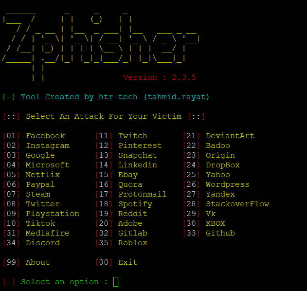
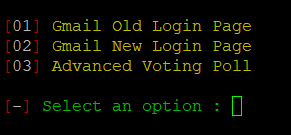
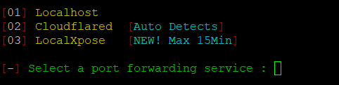
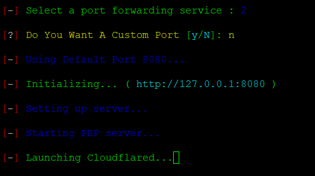
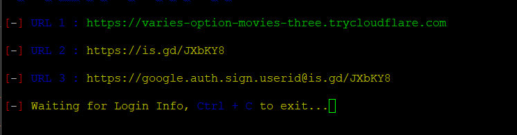

# Projecte 9: ZPhisher + Google Sign In HTML Template
### Autors: Ferran Garcia, Adrià Manero, Sergi Giribet, Gerard Loriz
---
## INDEX

- [ABOUT](adri.md#about)
- [EXPLICACIÓ TECNICA](adri.md#explicació-tecnica)
- [PARAULES CLAU](adri.md#paraules-clau)
- [REQUISITS PREVIS](adri.md#requisits-previs)
- [EL NOSTRE SET-UP](adri.md#el-nostre-set-up)
- [TUTORIAL INSTAL·LACIÓ](adri.md#tutorial-installació)
- [VIDEO EXEMPLE](adri.md#video-exemple)
- [DISCLAIMER](adri.md#disclaimer)

---

## ABOUT

L’objectiu d’aquest projecte es comprometre la seguretat d’alguns comptes de correus corporatius dels alumnes de l’escola Ginebró a través d’un atac de phishing simulant una enquesta per un treball de recerca.

La finalitat d'això es mostrar que en qualsevol sistema, el punt més feble es el factor humà. En el mon de la ciberseguretat es necessita ser un expert en molts camps tècnics, però també és molt important entendre i “resoldre” a les persones. Això ho podem fer a traves de l'enginyeria social i la psicologia. 

Aquests son alguns dels conceptes i skills que volem ensenyar als professors en aquest projecte.

---
## 
---


## EXPLICACIÓ TECNICA

El atac de phishing que volem realitzar es basa en enviar un correu a les nostres víctimes on els hi demanem si podem omplir una enquesta de Google per el nostre treball de recerca. En el mateix correu estarà adjunt el link a aquesta enquesta, quan la víctima accedeix al link será dirigida a una pantalla on li demana que es registri amb el seu compte de Google, introduint així el seu correu i la contrasenya. Un cop ho fà automaticament es redirigit a una enquesta sobre la seguretat informatica en el dia a dia de les persones. En aquest punt nosaltres hem obtingut el correu i la contrasenya d'accés al compte de correu del alumne. El que ha succeït es el següent:

Primer de tot nosaltres (els atacants) tenim montat un servidor local en una Raspberry Pi amb Zphisher instal·lat. Hem modificat els arxius interns del programa per poder utilizar la nostre propia plantilla per realitzar el phishing. Aquesta plantilla l'hem dissenyat previament amb HTML, CSS, JS i PHP per que sigui el més similar al Sign In de Google. Al iniciar el programa, aquest ens demana quina plantilla volem utilitzar i quin servidor de sortida volem utilitzar. Aquí és on cloudflare entra en joc. Aquesta eina el que fa es crear un servidor a internet temporal amb un pont al nostre servidor local, això el que fa és que qualsevol persona desde qualsevol lloc pot accedir al nostre servidor, on la plantilla està allotjada.

Zphisher junt amb cloudflare ens permet crear un link amb un text personalitzat (enmascarem el link original) per que sigui el més similar al que sería un link de Sign In de Google.

Un cop aquest link esta generat només ens queda esperar a que alguna victima caigui en el phishing. Aquí és quan enviem aquest link adjunt al correu abans mencionat. A partir d’aquest moment el programa registra la IP de qualsevol dispositiu que accedeixi al link. I si la victima introdueix les seves dades, aquestes s’envien mitjançant el mètode POST de PHP a un arxiu .txt al servidor. 

Tant les IP’s com les dades de les víctimes es guarden el arxius amb extensió .dat (referint-se a que son datos) i es mostren per pantalla, en qüestió de segons.

--- 

## PARAULES CLAU

En el document [paraules clau](media/PARAULES%20CLAU.md) trobareu tota la informació.

---

## REQUISITS PREVIS

Els requisits per executar aquest projecte son els següents:

- Algun SO compatible amb Node.js i que estigui basat en Linux
- Node.js: versió 10.0 o superior
- Navegador web: Qualsevol navegador amb sortida a internet.
- Servidor: Qualsevol dispositiu electronic. PC, Laptop, Raspberry Pi, etc…
- Coneixements bàsics sobre: HTML, CSS, JS i scripting en BASH.

---

## EL NOSTRE SET-UP 

El nostre Setup es una Raspberry Pi 4 Model B amb el Raspberry Pi OS (Que està basat en debian) amb els programes necessaris per fer la instal·lació: Git, Nano, Curl, etc…)

---

## TUTORIAL INSTAL·LACIÓ

```
    git clone https://github.com/SergiGiribet/google-SignIn
```

```
    cd google-SignIn
```

```
    cd zphisher-master
```

```
    chmod 777 zphisher.sh
```

```
    bash zphisher.sh
```
```
    Triem quina plantilla volem utilitzar:
```


```
    Triem el servidor de cloudflare:
```

```
    Deixem el port per defecte:
```

```
    Enmascarem el url amb una direcció que sembli de google (ex: google.auth.login.userid)
```

```
    Només falta enviar l'enllaç proporcionat a la persona que vulguem 
    i fer una mica d'ingenyeria social per aconsegui que aquella persona faci login
```
Tota la informació agafada de les víctimes quedarà guardada a l'archiu usernames.dat dins de la carpeta auth.


---

## VIDEO EXEMPLE

 En el següent link trobareu el [Video d'exemple](./media/exemplemp4.mp4)

---

## DISCLAIMER

El software de phishing és una eina que simula pàgines web legítimes per obtenir informació personal dels usuaris. Malgrat això, els creadors afirmen que la seva intenció no és perjudicar els usuaris, sinó per demostrar la vulnerabilitat de les pàgines web i promoure la seguretat informàtica.
El projecte ha estat desenvolupat amb l'objectiu de proporcionar als estudiants i als professionals de la seguretat informàtica una eina per comprendre les vulnerabilitats dels sistemes informàtics i les tècniques que poden utilitzar els hackers per accedir a informació confidencial.
No ens fem responsables del posibles usos inadequats que se li puguin donar a aquesta eina.


---


