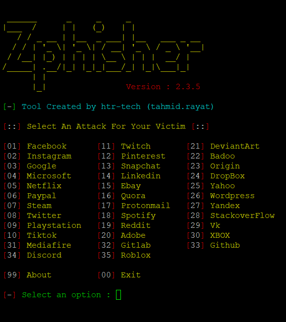
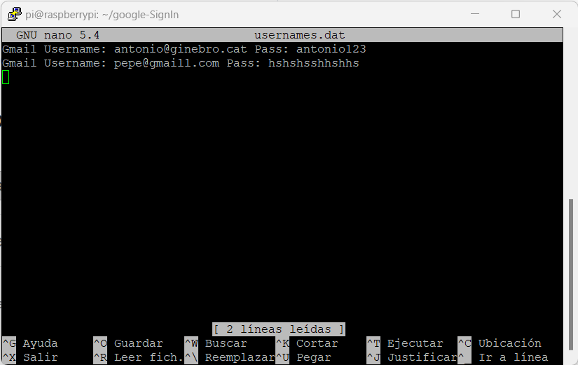
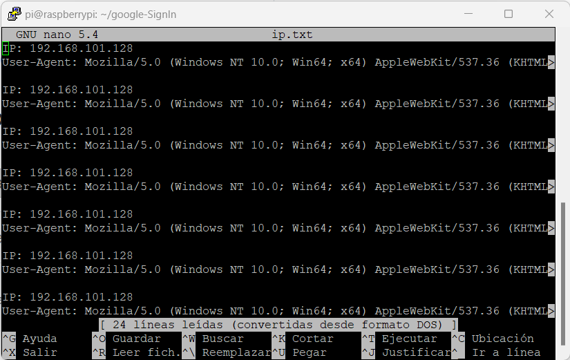

# PROPOSTA INICIAL

## Proposta Projecte 9: Ensenya als profes

Bones, seríem l'Adriá Manero, el Gerard Loriz, en Sergi Giribet i jo, Ferran Garcia, i el nostre projecte es basarà en simular (de manera controlada) un atac de phishing a través de Black Eye. Aquest atac de phishing estarà darrere d'un inici de sessió de Google fals creat per nosaltres amb HTML, CSS i JS molt semblant ( pràcticament idèntic ) a l'inici de sessió original. Aquest inici de "sessió de Google" serà necessari per a poder accedir a un formulari de Google, com si fos un treball de recerca, és a dir, que l'usuari es pensarà que per a accedir al formulari haurà d'iniciar sessió, i el que realment fará será enviar-nos al nostre servidor Debian el text que ha introduït en format Excel. Totes les dades es reculliran en un arxiu txt i posteriorment es guardaran en un fitxer .dat.

IMPORTANT: Tot aquest procés s'anirà redactant i el resultat final será de manera educativa i sense cap tipus d’intenció que posi en problemes la seguretat i privacitat de ningú.

---

Aquest servidor de phishing estarà allotjat dintre d'una raspberry pi, és a dir, necessitarem alguna manera de poder muntar un servidor dins d'aquesta. El mètode que hem triat ha sigut Ngrok, ja que ens permet fer un pont entre la raspberry pi i internet.
---

---

| Contingut | Descripció | Última modificació |
| --------- | ----------- | -------------------|
| Zphisher | Zphisher, és una eina actualitzada de ShellPhish la qual ens permet fer treballs de Pentesting relacionats a enginyeria social. És una eina de pesca phishing molt completa. | 25/04/2023 |
| Plantillas HTML | Les plantilles HTML són fitxers predefinits que contenen el codi HTML bàsic necessari per crear un lloc web. Els usuaris poden personalitzar aquestes plantilles per adaptar-les a les vostres necessitats específiques. | 20/04/2023 |
| CSS | CSS (Cascading Style Sheets) és un llenguatge utilitzat per descriure la presentació visual d'un document HTML o XML. Permet als usuaris personalitzar l'aparença dels elements d'una pàgina web, com ara el color, la font i la mida. | 20/04/2023 |
| JavaScript de Google | El JavaScript de Google és un conjunt d'eines i tecnologies utilitzades per crear aplicacions web. Permet als desenvolupadors crear aplicacions web altament interactives i dinàmiques mitjançant la manipulació del contingut HTML i CSS en temps real. | 20/04/2023 |
| PHP | PHP és un llenguatge de programació de codi obert utilitzat principalment per al desenvolupament d'aplicacions web del costat del servidor. | 25/04/2023 |
| Bash | Bash és un intèrpret de comandes o shell, que és una interfície d'usuari per interactuar amb el sistema operatiu d'un ordinador a través de la línia de comandes. És una eina molt potent que permet als usuaris realitzar diverses tasques, com executar programes, navegar per fitxers i directoris, automatitzar tasques repetitives, entre altres. | 26/04/2023 |

| Integrants del grup | Rol |
| --------- | --------- |
| Adria Manero | Idea I desenvolupament  |
| Ferran Garcia | Plantilles css i Html |
| Gerard Loriz | Raspberry pi i programació del servidor |
| Sergi Giribet | Plantilles Css, Html i php |

## 1. Requisits del sistema

Per poder fer aquest projecte és important tenir el seguent:

- Sistema operatiu: Un que sigui compatible amb Node.js i que estigui basat en Linux.
- Node.js: versió 10.0 o superior
- Navegador web: Cualsevol navegador amb sortida a internet.
- Ordinador servidor: En el nostre cas ha sigut una RaspberryPi
- Coneixaments en Php, html, css i bash 

## 2. Com iniciar el servidor:
```
    git clone https://github.com/SergiGiribet/google-SignIn
```
```
    cd google-SignIn
```
```
    cd zphisher-master
```
```
    chmod 777 zphisher.sh
```
```
    bash zphisher.sh
```
Tota la informació agafada de les víctimes quedarà guardada a l'archiu usernames.dat dins de la carpeta auth.



## 3. Video exemple:


# Important!!!


El software de phishing és una eina que simula pàgines web legítimes per obtenir informació personal dels usuaris. Malgrat això, els creadors afirmen que la seva intenció no és perjudicar els usuaris, sinó per demostrar la vulnerabilitat de les pàgines web i promoure la seguretat informàtica.

El projecte ha estat desenvolupat amb l'objectiu de proporcionar als estudiants i als professionals de la seguretat informàtica una eina per comprendre les vulnerabilitats dels sistemes informàtics i les tècniques que poden utilitzar els hackers per accedir a informació confidencial.

